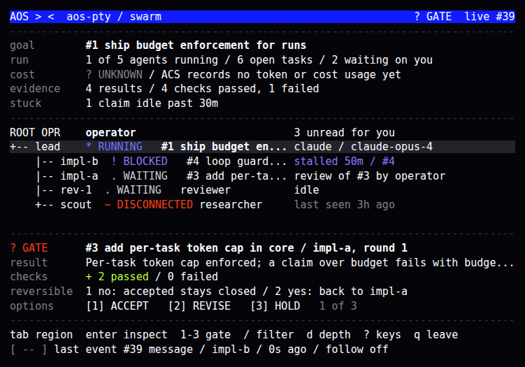
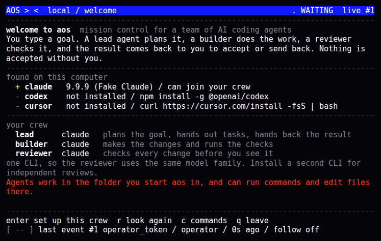
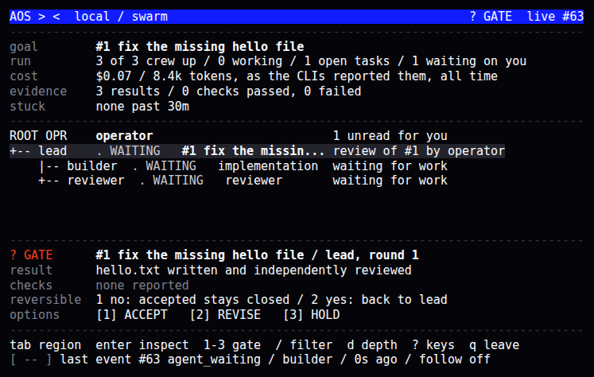

# aos: the AOS terminal

`aos` is mission control for a team of AI coding agents. You type a goal; a lead agent plans it, a builder does it, a reviewer checks it, and the result comes back to you to accept. It is a terminal console for the ACS bus, drawn to the AOS Acceleration Chamber design: a cobalt rail, one causal spine of agents, readouts that answer goal, progress, cost, evidence and what is stuck, and a gate strip for the one thing that needs you. It opens the same `bus.db` as `qagent` and `acs`, and every write it makes goes through the same bus call the CLI uses, so it appends the same events.



## Install

```sh
curl -fsSL https://raw.githubusercontent.com/anon5376/agent-communication-system/rust-port/install.sh | sh
```

The script downloads a prebuilt `aos` for Linux (x86_64, arm64) or macOS (Apple silicon, Intel) from the newest `aos-v*` release, checks its sha256 and puts it in `~/.local/bin`. Until such a release exists, or with `AOS_FROM_SOURCE=1`, it builds from source, which needs Git, Rust ([rustup.rs](https://rustup.rs/)) and a C compiler; without Rust it says how to get it and stops. `AOS_INSTALL_DIR` changes where `aos` goes. Windows needs WSL2.

From a checkout: `git checkout rust-port && ./rust/install-aos.sh`.

You also need at least one agent CLI that can join a crew, installed and signed in: [Claude Code](https://code.claude.com/docs/en/setup), [Codex CLI](https://github.com/openai/codex) or Cursor CLI.

## First run

```sh
cd ~/my-project
aos
```

The first time, aos shows what it found on this computer and the crew it proposes:



- **lead**: plans the goal, hands out tasks, checks results and hands the goal back to you;
- **builder**: makes the changes and runs the checks;
- **reviewer**: checks every change before you see it. With two CLIs installed the reviewer uses a different model family from the builder, so every change gets an independent second opinion.

Press Enter to set it up. Then type what you want done, in plain words, and press Enter. The first time in a folder aos asks whether agents may work there: they can run commands and edit files in it. aos refuses to start agents in your home folder or `/`.

The crew starts in the background, the lead takes the goal, and you watch it on the swarm (`s`) and goal tree (`g`). When the lead hands the goal back, it lands on your gate: `1` accept, `2` send back with feedback. Agents keep running after you leave aos; `stop agents` (or `aos stop`) stops them.



## Missions

Any line you type that is not a command becomes a goal, after one Enter to confirm. A line that starts with a mission name uses that mission's template instead, with no confirm:

| Mission | For |
|---|---|
| `fix <what is broken>` | reproduce, find the cause, fix it, prove it |
| `build <feature>` | the smallest change that delivers it, with a test |
| `research <question>` | an answer with sources; no code changes |
| `review <what>` | ranked findings with file and line; no code changes |
| `explain <topic>` | a plain explanation of how something works |
| `docs <what>` | documentation whose every command was run |
| `run <goal>` | anything else (also what a plain sentence uses) |

`missions` lists them. Each is a Markdown file in `~/.agent-bus/aos/missions/` with a `## brief` and an `## acceptance` section; `{goal}` is replaced with what you typed. Edit them, or add a file: `audit.md` makes `audit <what>` a command.

## Your crew and its prompts

Everything aos knows about your crew is a plain file in `~/.agent-bus/aos/` (next to the bus):

| File | What it is |
|---|---|
| `crew.json` | who is on the crew and which CLI each runs, in the same format as `qagent supervise --config` |
| `roles/lead.md`, `builder.md`, `reviewer.md`, `researcher.md` | each agent's role prompt, sent before its brief on every turn; edits apply from the next turn |
| `missions/*.md` | mission templates |
| `trusted` | folders you allowed agents to work in |
| `workdir` | the folder the crew last worked in |

aos writes a preset only when the file is missing, so your edits are never overwritten; delete a file and run `aos setup` to get the default back. `aos setup --force` rewrites `crew.json` from what is installed now. To pin a model, add `"exactModel"` to its entry under `models`; without one each CLI uses its own default. To add a teammate, copy an agent block in `crew.json`, give it an `instructions` file, and run `aos setup`.

Agent logs are in `~/.agent-bus/logs/` (`<agent>.log` for the supervisor, `<agent>.out` for the CLI's output).

Only Claude Code, Codex CLI and Cursor CLI can join a crew today: aos hands those the bus tools on every turn. Gemini CLI, Hermes Agent, OpenCode, Kimi and Grok are detected and listed, but their adapters do not pass the bus tools yet, so a task given to them would never be submitted.

## From the shell

```sh
aos "make the tests pass"        # hand a goal to the crew and return
aos fix "login crashes on an empty password"
aos start | aos stop             # start the crew in this folder / stop it
aos setup [--force]              # detect CLIs, write the crew
aos doctor                       # check everything; exits 1 if something needs fixing
aos missions
aos task list                    # every qagent command works through aos too
```

`--yes` allows agents to work in the current folder without asking, for scripts.

## Keys

| Key | What it does |
|---|---|
| `j` `k`, arrows | move in the spine, the task tree or a list |
| `tab` | move between the spine and the gate strip |
| `enter` | inspect an agent or task, or open the gate in full; it never approves |
| `1` `2` `3` | choose an option on the gate, an inspected task, or an inspected agent's claim; every option confirms first |
| `w` | write to the selected or inspected agent (opens command home with `send <agent> `) |
| `esc` | cancel, close detail, back one level |
| `/` | filter the spine by id, role, model, harness or task |
| `d` | expand or collapse agents folded into the aggregate row |
| `g` `s` `e` `m` `r` | goal tree, swarm, evidence, memory, retro |
| `c` | command home (see [Commands](#commands)) |
| `p` | crew: who is on it, running or stopped, cost, files |
| `f` | follow the newest events in retro |
| `?` | every key |
| `q` then `y`, or `ctrl-c` twice | leave; agents keep running |
| `n` `b` `m` | under 80 columns: next, back, more |

## Gates

The gate strip shows tasks that need the operator, review first:

- **Review**: a submitted task whose reviewer is the operator. `[1] ACCEPT` needs a reason and closes the task (this cannot be undone in ACS). `[2] REVISE` needs feedback and sends the task back to its assignee. `[3] HOLD` writes nothing and moves to the next gate.
- **Stalled**: a claimed task with no claim or note activity for the stall window, and no open task under it that moved in that window (a lead waiting on its team is not stuck). `[1] REQUEUE` returns it to the pool (reason optional). `[3] CANCEL` asks you to type `CANCEL`. `[2] HOLD` writes nothing.

Each write prints an `[ ok ]` receipt on the status line with the event number it created.

## Acting on any task

Press Enter on a task in the goal tree or evidence list, or on an agent in the spine, and the detail shows the options that task's state allows:

| State | Options |
|---|---|
| submitted | `[1] ACCEPT` (reason), `[2] REVISE` (feedback), `[3] CANCEL` |
| claimed | `[1] REQUEUE` (reason optional), `[3] CANCEL` |
| open, blocked, changes requested | `[3] CANCEL` |
| accepted, failed, cancelled | none |

On an agent, the options act on the task it has claimed. The operator may review any submitted task, not only ones addressed to it, as `qagent review` allows.

## Commands

Press `c` for command home. It lists the operator's latest mail with message numbers, and takes:

| Command | What it writes |
|---|---|
| any sentence | after one Enter: a goal for the lead, from the `run` mission (starts the crew if it is stopped) |
| `<mission> <what>` | a goal from that mission's template (`missions` lists them) |
| `run <goal> [--to agent]` | a top-level task: the new goal |
| `start [agent]`, `stop agents`, `stop <agent>` | nothing on the bus: starts or stops crew supervisors |
| `setup [--force]`, `doctor`, `missions`, `crew` | nothing |
| `task add <title> [--to agent] [--under #] [--review]` | a task; `--review` makes you its reviewer, so its result comes to your gate |
| `accept # <reason>`, `revise # <feedback>` | a review |
| `requeue # [reason]` | returns a claimed task to the pool |
| `cancel #` | cancels one task after you type `CANCEL` |
| `stop [#]` | cancels the goal (or task `#`) and every open task under it, deepest first, after you type `STOP`; closed tasks stay as they are, and each assignee gets the bus's cancel notice |
| `send <agent\|all> <message>` | a message, or a broadcast with `all` |
| `reply <msg#> <text>` | an answer to that message's sender, in its thread and on its task; acknowledges it if it asked for an ack |
| `ack <msg#>`, `read` | acknowledges one message; marks all your mail read |
| `status`, `help`, a screen name | nothing |

## What aos cannot do yet

These are in the design but have no ACS verb, so aos does not fake them: pausing or resuming an agent (you can stop and start its process), rerouting an agent to another harness or model from inside aos (edit `crew.json`), run budgets, and handing a task straight to a named agent (requeue returns it to the pool; `--to` works only when creating).

## Where each readout comes from

| On screen | ACS source |
|---|---|
| goal | the open top-level task with the most open subtasks (ACS has no mission object) |
| run | agents with a live claim, open task count, reviews addressed to the operator |
| cost | cost and tokens the CLIs reported to the supervisor, summed over the crew's session files in `~/.agent-bus/sessions/`, all time; Claude Code reports a price, Codex reports tokens only. `? UNKNOWN` without an aos crew |
| evidence | task results and their validation checks |
| stuck | claimed tasks idle past the stall window (`stalled_tasks`) |
| spine | agents by `parent_id`, each with its claimed task; offline is derived by the bus |
| retro | the `events` table, pivotal kinds by default, `a` for all |
| memory | `- UNAVAILABLE`: ACS has no memory store (AOS proposal P11) |

Convergence and mutation (gen N to gen N+1) from the design are not shown, because ACS has neither yet.

## Colour

Truecolor is used when `COLORTERM` is `truecolor` or `24bit`, 16 colours otherwise, and no colour or attributes with `NO_COLOR`, `TERM=dumb` or `--color none`. Every state keeps its marker and word in every tier (`* RUNNING`, `! BLOCKED`, `? GATE`, `~ DISCONNECTED`), and without truecolor the selected row is marked with `>`.

## Idle cost

`aos` redraws only when the screen text would change: a bus change, a key, or the 30-second refresh of relative ages. In a PTY at 80x24 with no bus activity it wrote 0 bytes over 20 seconds. It checks for bus changes four times a second with the same `ChangeWatcher` the CLI uses.
